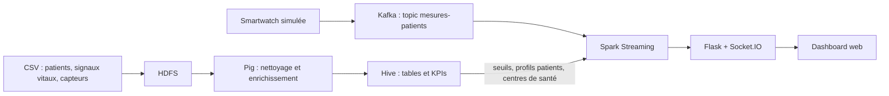

# Surveillance en temps réel de patients âgés à domicile

Pipeline **Big Data** complet pour suivre à distance des patients âgés : ingestion de mesures de capteurs (smartwatch simulée), nettoyage et enrichissement des données, calcul de KPIs de santé, puis **alertes en temps réel** affichées dans un dashboard web.

**Stack :** Hadoop (HDFS) · Pig · Hive · Kafka · Spark Structured Streaming · Flask + Socket.IO · Docker

> Démo interactive du dashboard (données simulées dans le navigateur) : **[lien à ajouter après la mise en ligne du portfolio]**


## Objectif

Permettre à une équipe médicale de repérer rapidement les patients dont les constantes vitales sortent des seuils de sécurité : chaque mesure reçue est comparée à des seuils médicaux, classée en `NORMAL`, `WARNING` ou `CRITIQUE`, et les cas critiques remontent en premier avec le dossier du patient.

## Architecture




| Étape | Rôle |
|---|---|
| **HDFS** | Stockage des profils patients, signaux vitaux (CSV) et état des capteurs |
| **Pig** | Filtrage qualité (capteurs actifs avec batterie ≥ 20 %, signal non « mauvais », valeurs manquantes), jointures signaux + capteurs + patients, génération de 9 flags (0/1) |
| **Hive** | Tables structurées, calcul de 4 KPIs par patient et par jour, vue globale `vue_dashboard_patient` |
| **Kafka** | Ingestion des mesures simulées (une mesure toutes les 2 s, clé = `patient_id`) |
| **Spark** | Lecture du flux Kafka par micro-batchs de 5 s, comparaison aux seuils chargés depuis Hive, enrichissement avec le profil patient, envoi des alertes |
| **Flask + Socket.IO** | Pont temps réel entre Spark et le navigateur |

### Les 4 KPIs (Hive)

1. **Moyennes journalières** de la fréquence cardiaque, de la fréquence respiratoire, de la glycémie, de la température et de la SpO2 (avec min et max).
2. **Taux d'hypertension** par patient (systolique ≥ 140 ou diastolique ≥ 90) et classification en grades.
3. **Score de stabilité cardiaque** (0 à 100) fondé sur les épisodes de tachycardie, de bradycardie et l'écart à la fréquence normale.
4. **Indice d'oxygénation** combinant SpO2 et fréquence respiratoire, avec détection de détresse respiratoire probable.

### Seuils d'alerte (table `seuils_alerte`)

| Signal | Warning | Critique | Unité |
|---|---|---|---|
| Fréquence cardiaque | < 60 ou > 100 | < 40 ou > 130 | bpm |
| SpO2 | < 94 | < 90 | % |
| Température | < 36 ou > 38 | < 35 ou > 39,5 | °C |
| Tension systolique | < 90 ou > 140 | < 80 ou > 180 | mmHg |
| Tension diastolique | < 60 ou > 90 | < 50 ou > 110 | mmHg |
| Glycémie | < 0,70 ou > 1,10 | < 0,50 ou > 2,50 | g/L |
| Fréquence respiratoire | < 12 ou > 20 | < 8 ou > 30 | rpm |

## Dashboard

- Compteurs : alertes totales, critiques, warnings, patients surveillés.
- Cartes patients **triées par gravité**, avec constantes vitales et alertes actives.
- Flux d'alertes en direct.
- Dossier patient : profil, localisation, médecin référent, numéro d'urgence, seuils de référence et actions possibles.

## Structure du dépôt

```
.
├── docker-compose.yml          # 10 services : Hadoop, Hive, Pig, Spark, Kafka, dashboard
├── Dockerfile                  # image Pig (Pig 0.17 sur l'image Hadoop)
├── pig_scripts/pig_etl.pig     # ETL : nettoyage, jointures, flags
├── hive_scripts/hive_kpis.hql  # tables, seuils, 4 KPIs, centres de santé
├── spark_scripts/
│   ├── kafka_producer.py       # simule une smartwatch
│   ├── spark_alertes.py        # streaming et détection des alertes
│   ├── server.py               # Flask + Socket.IO
│   └── dashboard.html          # interface web
├── datasets/                   # échantillons synthétiques (CSV)
└── docs/                       # schémas et captures
```

## Lancer le projet

**Prérequis :** Docker Desktop (Docker Compose inclus), avec 6 à 8 Go de mémoire alloués au minimum : le projet démarre 10 conteneurs. Le premier démarrage télécharge plusieurs images et prend quelques minutes.

Plusieurs étapes demandent des terminaux séparés ; ils sont indiqués ci-dessous. **Respecte l'ordre des étapes.**

### 1. Démarrer les conteneurs

```bash
git clone https://github.com/Chaki0107/realtime-patient-monitoring.git
cd realtime-patient-monitoring
docker compose up -d --build
```

### 2. Charger les données dans HDFS

Copie les fichiers CSV de `datasets/` dans le conteneur `namenode` :

```bash
docker cp datasets/Table_Alertes.csv namenode:/tmp/
docker cp datasets/Table_Capteurs.csv namenode:/tmp/
docker cp datasets/Table_SignauxVitaux.csv namenode:/tmp/
docker cp datasets/Table_Patients.csv namenode:/tmp/
docker exec -it namenode bash
```

Puis, **dans le conteneur namenode** (garde ce terminal ouvert, il sert encore plus bas) :

```bash
hdfs dfs -mkdir -p /user/hadoop/input
hdfs dfs -put /tmp/Table_SignauxVitaux.csv /user/hadoop/input/
hdfs dfs -put /tmp/Table_Patients.csv /user/hadoop/input/
hdfs dfs -put /tmp/Table_Capteurs.csv /user/hadoop/input/
hdfs dfs -put /tmp/Table_Alertes.csv /user/hadoop/input/
hdfs dfs -ls /user/hadoop/input/        # vérification
hdfs dfs -mkdir /user/hadoop/output
```

### 3. Nettoyer et enrichir les données avec Pig

Dans un **nouveau terminal** :

```bash
docker exec -it pig bash
pig /pig_scripts/pig_etl.pig
```

Vérification, dans le terminal namenode :

```bash
hdfs dfs -tail /user/hadoop/output/data_final_patients/part-r-00000
```

### 4. Préparer la table patients pour Hive

Hive lit les profils patients dans un dossier dédié. **À faire après Pig** : le script Pig lit `Table_Patients.csv` à la racine de `/user/hadoop/input/`. Dans le terminal namenode :

```bash
hdfs dfs -mkdir /user/hadoop/input/patients
hdfs dfs -mv /user/hadoop/input/Table_Patients.csv /user/hadoop/input/patients/Table_Patients.csv
```

### 5. Calculer les KPIs avec Hive

Dans un **nouveau terminal**. L'initialisation du metastore ne se fait qu'au premier lancement :

```bash
docker exec -it hive schematool -dbType postgres -initSchema
docker exec -d hive hive --service metastore
docker exec -it hive bash
hive -f /hive_scripts/hive_kpis.hql
```

Le script se termine par un tableau de vérification qui donne le nombre de lignes de chaque table.

### 6. Créer le topic Kafka

Dans un **nouveau terminal** :

```bash
docker exec -it kafka bash
kafka-topics --create --topic mesures-patients --bootstrap-server localhost:9092 --partitions 1 --replication-factor 1
kafka-topics --list --bootstrap-server localhost:9092    # vérification
```

### 7. Lancer le streaming Spark (terminal 1)

```bash
docker restart dashboard-alertes
docker cp datasets/nouvelles_observations.csv spark-master:/tmp/
docker exec -it spark-master bash
```

Dans le conteneur `spark-master` :

```bash
python3 -m pip install python-socketio==4.6.0 python-engineio==3.13.2 kafka-python requests flask
/spark/bin/spark-submit \
  --packages org.apache.spark:spark-sql-kafka-0-10_2.12:3.1.1 \
  /spark_scripts/spark_alertes.py
```

Attends l'affichage de `En attente de mesures Kafka`. L'installation des paquets Python est à refaire si le conteneur est recréé.

### 8. Envoyer les mesures (terminal 2)

Dans un **nouveau terminal**, simule la smartwatch :

```bash
docker exec -it spark-master bash
python3 /spark_scripts/kafka_producer.py
```

Pour suivre le serveur Flask (terminal 3, facultatif) :

```bash
docker logs dashboard-alertes -f
```

### 9. Ouvrir le dashboard

http://localhost:5001

Interfaces utiles : HDFS http://localhost:9870 · Spark http://localhost:8080.

### Relancer une simulation depuis zéro

Dans le conteneur `spark-master`, supprime le checkpoint Spark, puis redémarre le serveur du dashboard :

```bash
rm -rf /tmp/spark_checkpoint_alertes
docker restart dashboard-alertes
```

## Données

Les données utilisées sont **synthétiques**. Le dossier `datasets/` ne contient que de petits échantillons :

| Fichier | Contenu |
|---|---|
| `Table_Patients.csv` | Profils des patients |
| `Table_SignauxVitaux.csv` | Mesures des constantes vitales |
| `Table_Capteurs.csv` | État des capteurs |
| `Table_Alertes.csv` | Table des alertes |
| `nouvelles_observations.csv` | Mesures envoyées à Kafka pour simuler une smartwatch |

Les mots de passe présents dans `docker-compose.yml` sont des identifiants de démonstration pour un usage local uniquement.

## Auteure

**Chahnez Naccache** · Master Data Science · [LinkedIn](https://linkedin.com/in/chahnez-naccache) · [Portfolio](https://github.com/Chaki0107/Portfolio)
