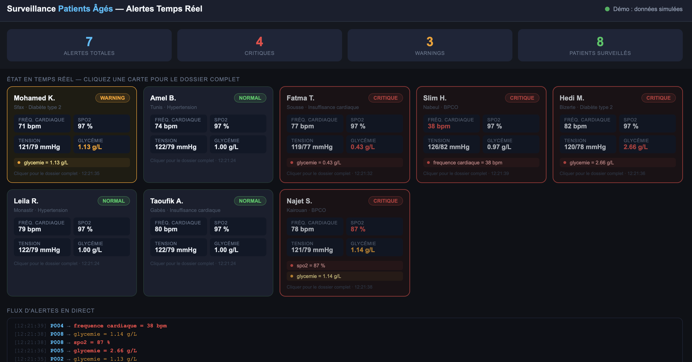
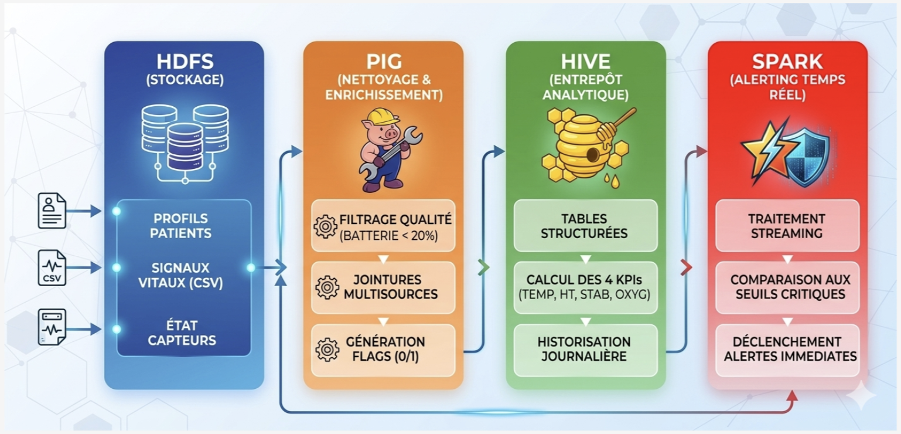
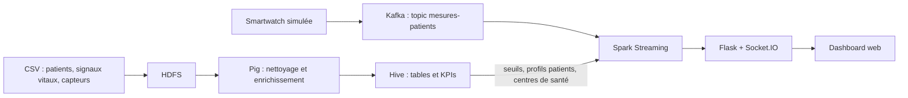

# Surveillance en temps réel de patients âgés à domicile

Pipeline **Big Data** complet pour suivre à distance des patients âgés : ingestion de mesures de capteurs (smartwatch simulée), nettoyage et enrichissement des données, calcul de KPIs de santé, puis **alertes en temps réel** affichées dans un dashboard web.

**Stack :** Hadoop (HDFS) · Pig · Hive · Kafka · Spark Structured Streaming · Flask + Socket.IO · Docker

> Démo interactive du dashboard (données simulées dans le navigateur) : **[lien à ajouter après la mise en ligne du portfolio]**



## Objectif

Permettre à une équipe médicale de repérer rapidement les patients dont les constantes vitales sortent des seuils de sécurité : chaque mesure reçue est comparée à des seuils médicaux, classée en `NORMAL`, `WARNING` ou `CRITIQUE`, et les cas critiques remontent en premier avec le dossier du patient.

## Architecture





| Étape | Rôle |
|---|---|
| **HDFS** | Stockage des profils patients, signaux vitaux (CSV) et état des capteurs |
| **Pig** | Filtrage qualité (capteurs actifs avec batterie ≥ 20 %, signal non « mauvais », valeurs manquantes), jointures signaux + capteurs + patients, génération de 9 flags (0/1) |
| **Hive** | Tables structurées, calcul de 4 KPIs par patient et par jour, vue globale `vue_dashboard_patient` |
| **Kafka** | Ingestion des mesures simulées (une mesure toutes les 2 s, clé = `patient_id`) |
| **Spark** | Lecture du flux Kafka par micro-batchs de 5 s, comparaison aux seuils chargés depuis Hive, enrichissement avec le profil patient, envoi des alertes |
| **Flask + Socket.IO** | Pont temps réel entre Spark et le navigateur |

### Les 4 KPIs (Hive)

1. **Moyennes journalières** de la fréquence cardiaque, de la fréquence respiratoire, de la glycémie, de la température et de la SpO2 (avec min et max).
2. **Taux d'hypertension** par patient (systolique ≥ 140 ou diastolique ≥ 90) et classification en grades.
3. **Score de stabilité cardiaque** (0 à 100) fondé sur les épisodes de tachycardie, de bradycardie et l'écart à la fréquence normale.
4. **Indice d'oxygénation** combinant SpO2 et fréquence respiratoire, avec détection de détresse respiratoire probable.

### Seuils d'alerte (table `seuils_alerte`)

| Signal | Warning | Critique | Unité |
|---|---|---|---|
| Fréquence cardiaque | < 60 ou > 100 | < 40 ou > 130 | bpm |
| SpO2 | < 94 | < 90 | % |
| Température | < 36 ou > 38 | < 35 ou > 39,5 | °C |
| Tension systolique | < 90 ou > 140 | < 80 ou > 180 | mmHg |
| Tension diastolique | < 60 ou > 90 | < 50 ou > 110 | mmHg |
| Glycémie | < 0,70 ou > 1,10 | < 0,50 ou > 2,50 | g/L |
| Fréquence respiratoire | < 12 ou > 20 | < 8 ou > 30 | rpm |

## Dashboard

- Compteurs : alertes totales, critiques, warnings, patients surveillés.
- Cartes patients **triées par gravité**, avec constantes vitales et alertes actives.
- Flux d'alertes en direct.
- Dossier patient : profil, localisation, médecin référent, numéro d'urgence, seuils de référence et actions possibles.

## Structure du dépôt

```
.
├── docker-compose.yml        # 10 services : Hadoop, Hive, Pig, Spark, Kafka, dashboard
├── Dockerfile                # image Pig (Pig 0.17 sur l'image Hadoop)
├── pig_scripts/pig_etl.pig   # ETL : nettoyage, jointures, flags
├── hive_scripts/hive_kpis.hql  # tables, seuils, 4 KPIs, centres de santé
├── spark_scripts/
│   ├── kafka_producer.py     # simule une smartwatch
│   ├── spark_alertes.py      # streaming et détection des alertes
│   ├── server.py             # Flask + Socket.IO
│   └── dashboard.html        # interface web
├── datasets/                 # échantillons synthétiques
└── docs/                     # schémas et captures
```

## Lancer le projet

**Prérequis :** Docker et Docker Compose.

```bash
git clone https://github.com/Chaki0107/realtime-patient-monitoring.git
cd realtime-patient-monitoring
docker compose up -d --build
```

1. **Charger les données dans HDFS** (fichiers CSV placés dans `datasets/`)
   ```bash
   docker exec -it namenode hdfs dfs -mkdir -p /user/hadoop/input/patients
   docker exec -it namenode hdfs dfs -put -f /datasets/Table_Patients.csv /datasets/Table_SignauxVitaux.csv /datasets/Table_Capteurs.csv /user/hadoop/input/
   docker exec -it namenode hdfs dfs -put -f /datasets/Table_Patients.csv /user/hadoop/input/patients/
   ```
2. **Nettoyage et enrichissement avec Pig**
   ```bash
   docker exec -it pig pig /pig_scripts/pig_etl.pig
   ```
3. **Tables et KPIs avec Hive**
   ```bash
   docker exec -it hive hive -f /hive_scripts/hive_kpis.hql
   ```
4. **Lancer le streaming Spark**
   ```bash
   docker exec -it spark-master /spark/bin/spark-submit \
     --master spark://spark-master:7077 \
     --packages org.apache.spark:spark-sql-kafka-0-10_2.12:3.1.1 \
     /spark_scripts/spark_alertes.py
   ```
5. **Envoyer des mesures** (simulation de la smartwatch)
   ```bash
   docker cp datasets/nouvelles_observations.csv dashboard-alertes:/tmp/
   docker exec -it dashboard-alertes python3 /app/kafka_producer.py
   ```
6. **Ouvrir le dashboard** : http://localhost:5001

Interfaces utiles : HDFS http://localhost:9870 · Spark http://localhost:8080.

## Données

Les données utilisées (patients, signaux vitaux, capteurs) sont **synthétiques**. Ce dépôt ne contient que de petits échantillons dans `datasets/`. Les mots de passe présents dans `docker-compose.yml` sont des identifiants de démonstration pour un usage local uniquement.

## Limites et pistes d'amélioration

- Les identifiants patients diffèrent entre Kafka (`P003`) et Hive (`PAT0003`) : une normalisation est faite dans le code Spark ; unifier les identifiants à la source serait plus propre.
- Les seuils sont fixes et identiques pour tous les patients : ils pourraient être personnalisés par pathologie, ou remplacés par un modèle de détection d'anomalies.
- Le centre de santé le plus proche est déjà calculé côté Spark à partir de la table `centres_sante`, mais n'est pas encore affiché dans le dossier patient.
- Les boutons d'action du dashboard (envoyer un soignant, appeler l'urgence, exporter un rapport) sont des maquettes.
- Pas d'authentification ni de chiffrement : projet prototype, non destiné à un usage clinique.

## Auteure

**Chahnez Naccache** · Master Data Science · [LinkedIn](https://linkedin.com/in/chahnez-naccache) · [Portfolio](https://github.com/Chaki0107/Portfolio)
